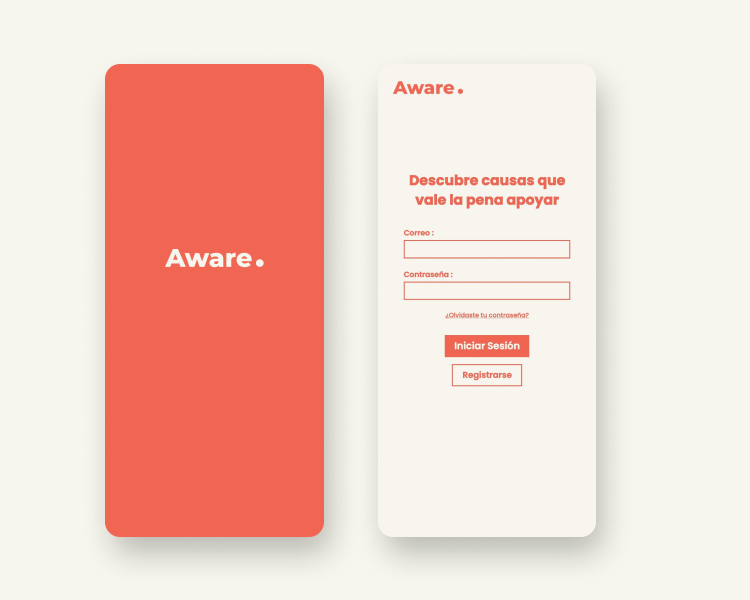
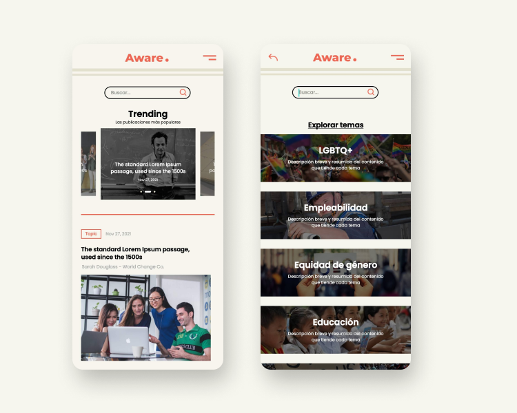
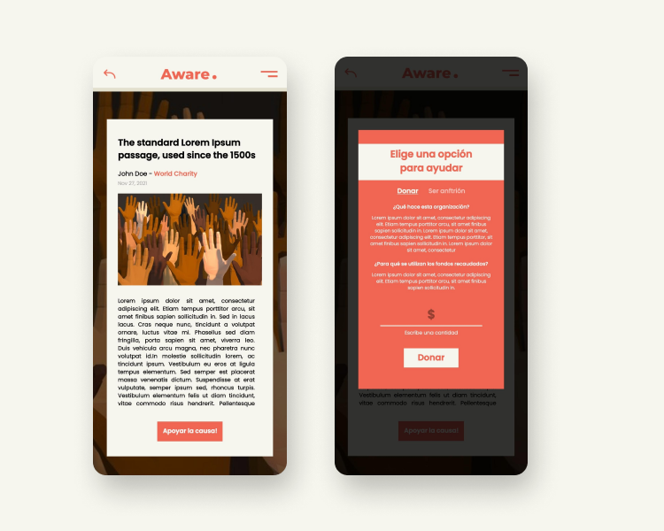

# Aware
### Project for Hackathon **Hack 4 Equality** 🏳️‍🌈 ♿
- - - -
_Where there were 3 main objectives:_

- _Raise awareness among people to create an environment of empathy, synergy and community, in addition to improving employability and human rights opportunities for the LGBTQ + community and people with disabilities with the help of technology._

- _Make visible areas of research, activists, communities, shelters, associations, student groups, etc. in a space of respect that allows them to have a national scope, so that their causes are heard and reach more people._

- _Add Organizations with the intention of interacting and consolidating efforts, collaborations, research and / or donations for the LGBTQ + community and people with disabilities._
- - - - -

**This is what we were able to design, create and developed in just 1 day 😁**

## What is this app about?
This is an app for NGOs to create their own newsletter where they can publicize their projects, conversation topics or news that they want to share with the world, and if people like what they are doing they can contribute by donating or affiliating with a monthly subscription that will gave them access to exclusive content and/or souveniers from the organization like stickers or t-shirts for example, as a symbol of grattitude

